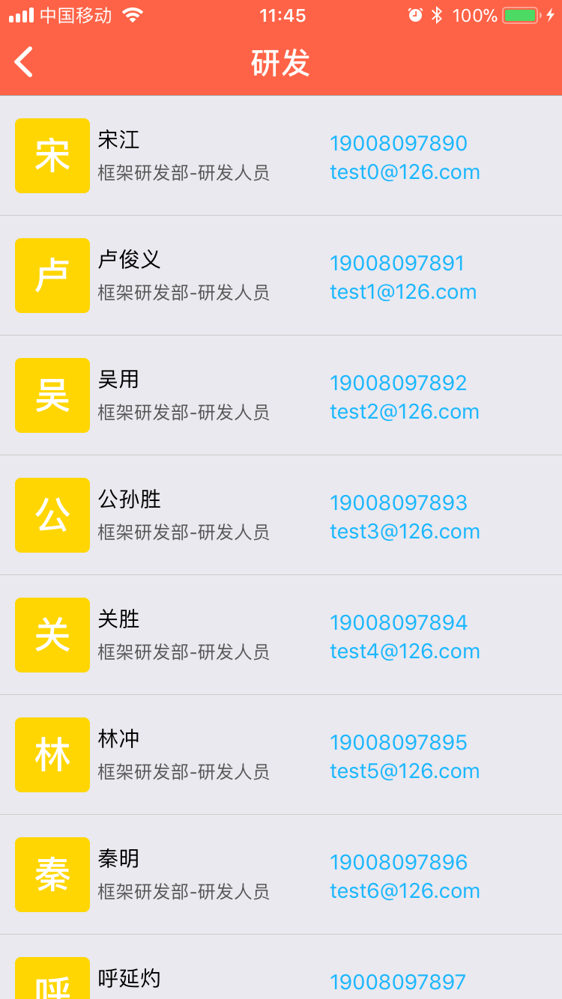
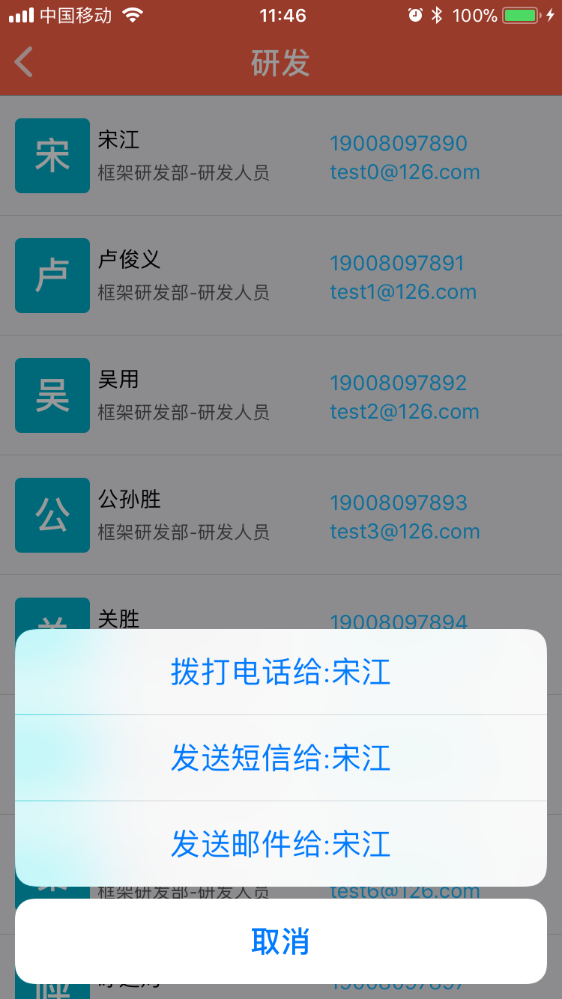
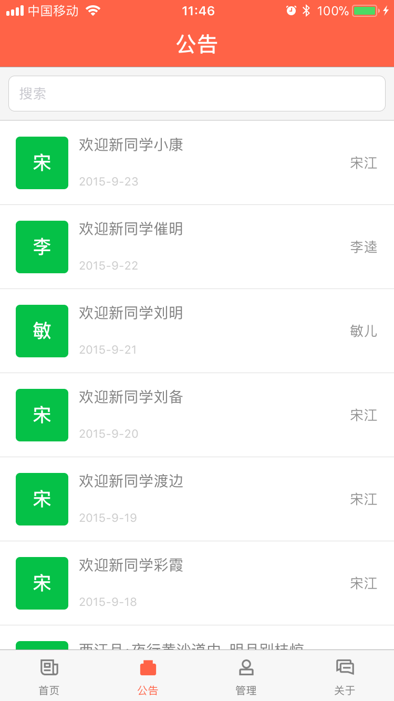
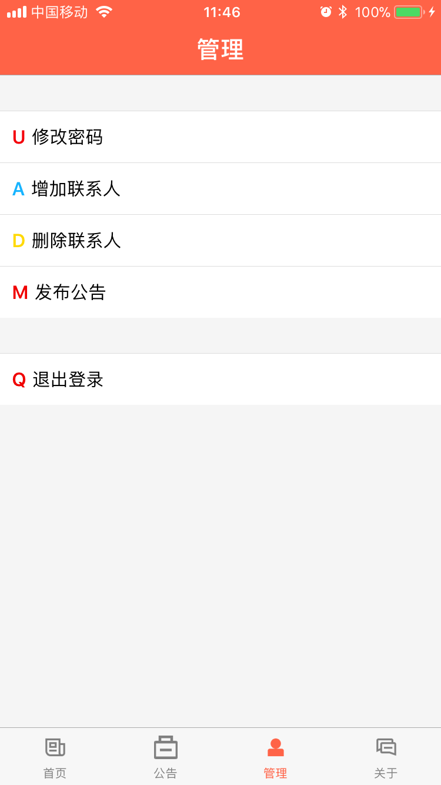
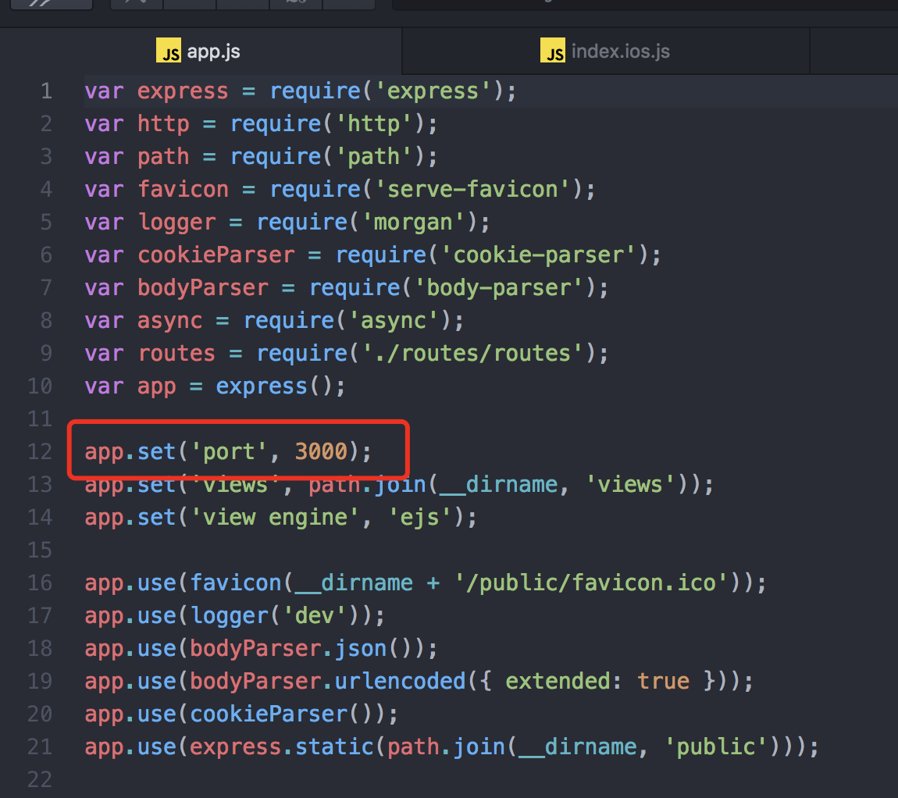
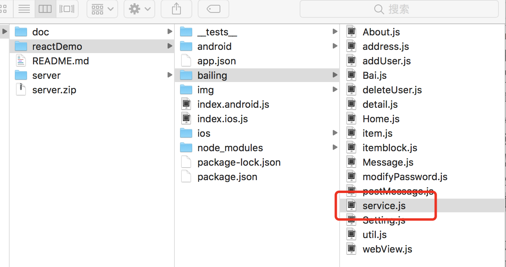
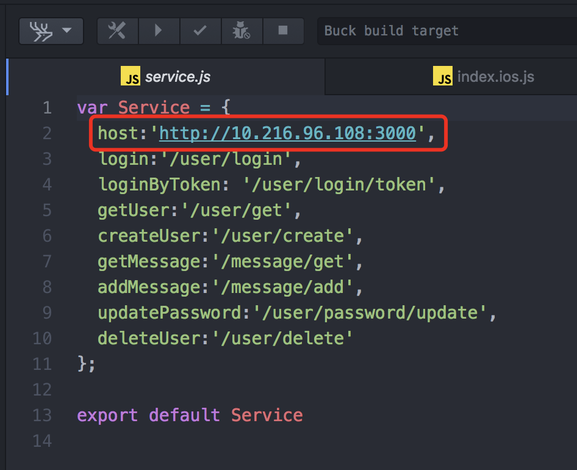

# tongXunLuDemoRN
ReactNative配合node.js实现的公司通讯录管理app

## demo项目说明
该项目是使用ReactNative写的一个通讯录管理系统，服务端程序是使用node.js实现的，由于只是一个小demo没有使用数据库保存数据，只是使用的json文档的形式进行数据存储，使用*react-navigation*组件来实现tabbar和navigationBar,跳转到其他到页面时隐藏底部的tabbar；该项目主要分为四个部分首页、公告、管理和关于，详情如下：
### 首页
主要展示公司部门，点击对应的部门进入该部门的通讯录列表，点击列表后面的电话或邮件，弹出actionView，可以拨打电话和发送邮件或信息等；

通讯录列表：

拨打电话等：

### 公告页面
展示发送的所有公告信息列表，点击可以进入公告详情页面；

### 管理页面
包过修改密码、增加联系人、删除联系人、发布公告、退出登录等；

### 关于我们
简单写了假页面，以及三个按钮，可以跳转到本人的git、sina、csdn，做的不是很好，大家见谅，主要是展示webView的用法；

## 服务环境说明及启动
为了配合app，我们使用了一个node.js的服务程序，所以运行服务端程序需要有node环境，这个各位朋友可以自行google安装，脚本的默认启动端口是3000，如果运行时被占用，请自行修改server目录下的app.js脚本,如图:

### 运行服务端脚本
1. 解压server.zip
2. 打开黑框，切换到server目录下
3. 执行命令:node app.js
4. 终端出现-------- listening on port: 3000 ------------运行成功
5. 浏览器输入127.0.0.1：3000/test/test测试能否正常访问

## 环境配置
app中有很多地方需要实现网络请求，所以我们写了一个公共的js文件，管理

根据服务端脚本的运行情况，设置网络请求的地址，在service.js中修改host地址，修改为运行服务端脚本的电脑的ip地址和上面设置的端口号，切记不要设置成127.0.0.1：3000，这是在本机电脑上访问的回环地址，手机访问是获取不到数据的，一定要设置成电脑的ip，具体电脑的ip地址获取方法，请自行查找，应该把手机和电脑连接到同一个局域网中，如果服务端脚本运行在服务器，这里设置是服务器ip或域名：

## 运行RN项目
打开reactDemo文件夹，进入ios目录下，用Xcode打开项目运行到手机上查看效果，可能会出现bundle id被占用的情况，简单修改再次运行。

## 补充说明
运行起来的时候登录的账号可以使用
user:swhglcat@sina.com
pwd:123456
进行登录，为了演示删除用户时的权限问题，在代码中判断了一下用户名是否是swhglcat@sina.com,当前用户不是该用户不能执行删除操作，你们可以自行修改代码，或者登录后可以添加其他用户，然后用新添加的用户登录，执行删除用户操作，查看效果。

## 感谢
感谢王丽华、魏晓军、冯诚祺的《React Native入门与实战》这本书对我在RN学习上的帮助，不过这本书现讲的跟现在的RN版本和编程方式有了很大的语法差异，但是原理相同，大家可以自行查找其他资料学习；最后感谢网络上的各位大神提供的学习资料，感谢google，以后我也将会更加努力的学习，争取跟大家共同学习，也希望有什么做的不好的，或者不对的地方，大神能够批评指正，我一定会虚心学习，感激不尽的。
